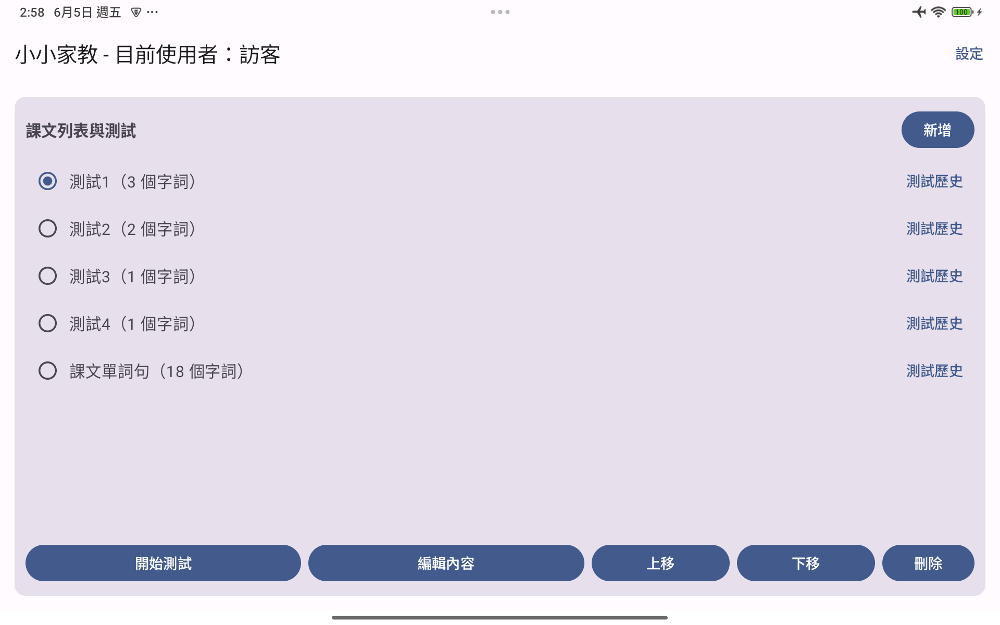
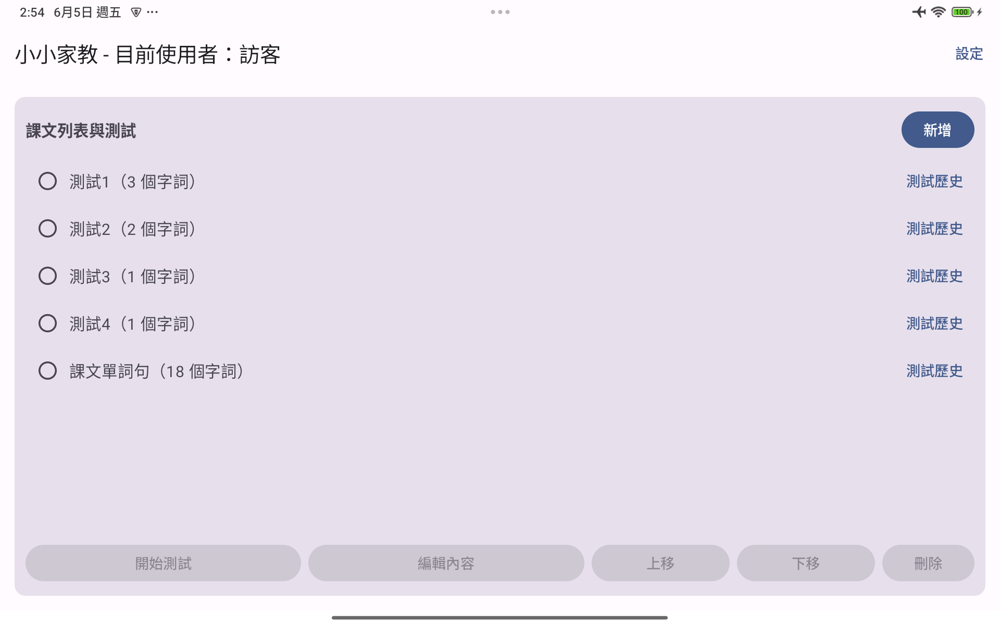
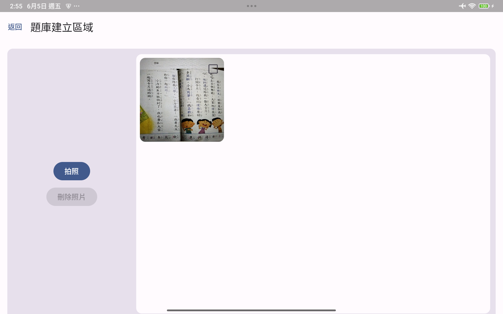
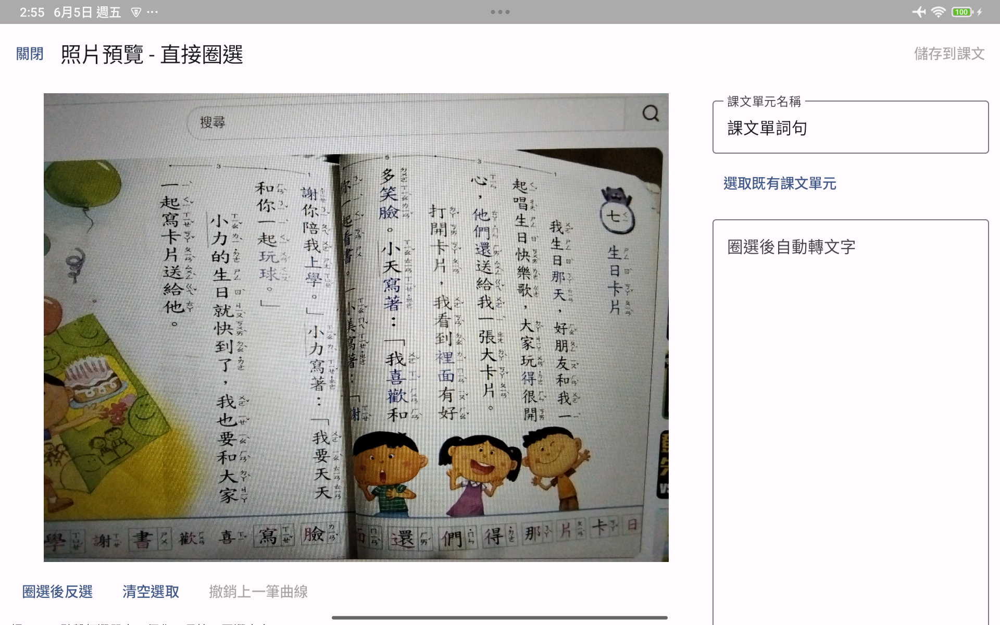
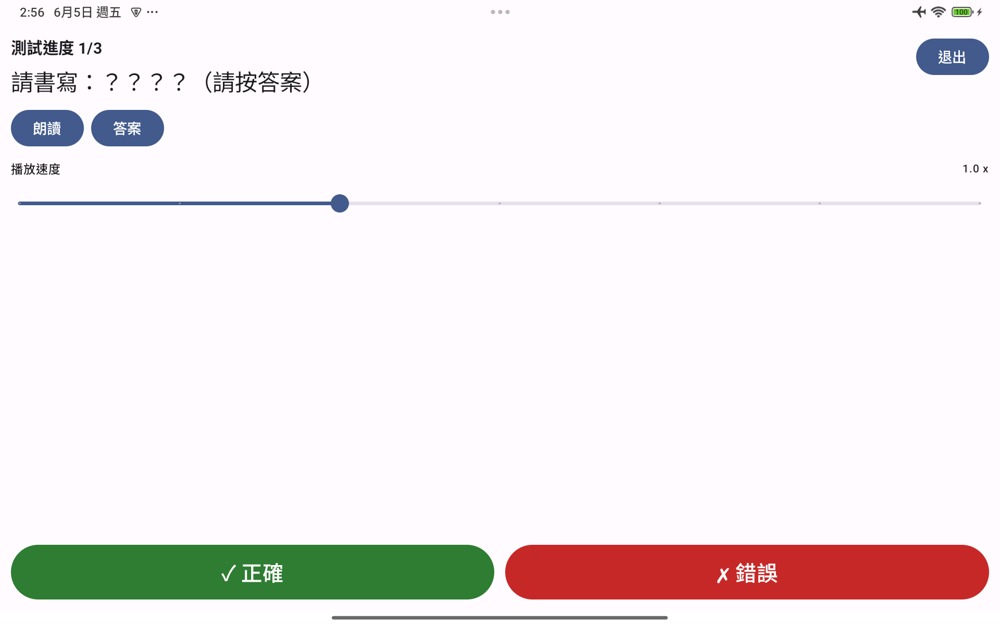
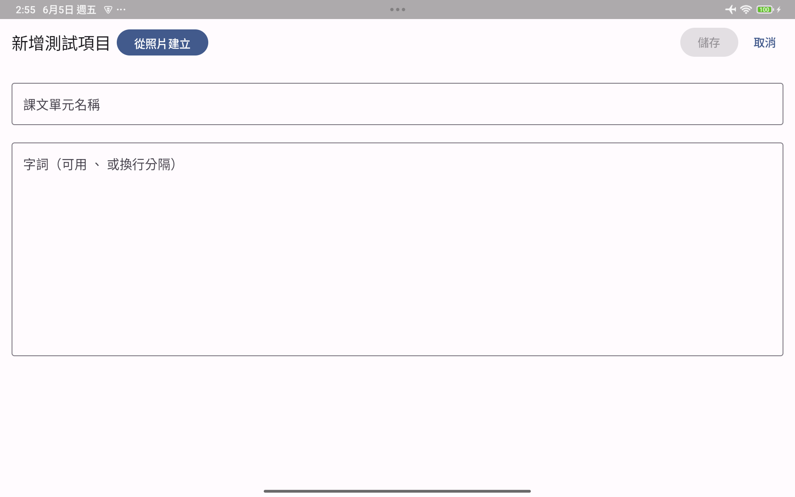
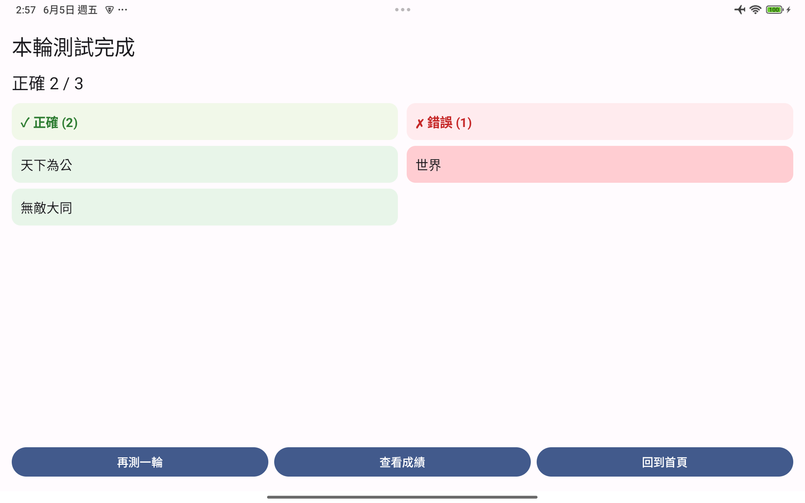
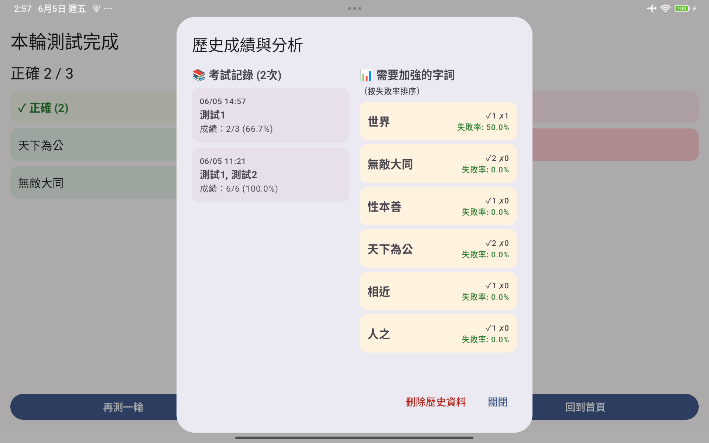

# LittleTutor

[English](#english) | [繁體中文](#繁體中文)

---

## English

LittleTutor is an integrated Android learning companion designed for elementary school students, focusing on mastering Chinese and English vocabulary. It combines high-precision OCR text recognition, interactive handwriting tests, and personalized progress tracking to bridge physical textbooks with digital learning.

This app aims to act as a "personal tutor," helping children review their lessons systematically while providing parents with clear learning data.

### 📸 Screenshots

| Home | Manage Units | Camera / OCR | Lasso Selection |
| :---: | :---: | :---: | :---: |
|  |  |  |  |

| Handwriting Test | Test Mode | Round Result | Analytics |
| :---: | :---: | :---: | :---: |
|  |  |  |  |

### 🚀 Core Features

#### 📸 Rapid Textbook Digitization
*   **Text Recognition (OCR):** Powered by Google ML Kit, capture textbook photos to recognize text directly.
*   **Lasso Selection for Question Banks:** Use "tap" or "lasso" selection to precisely pick words from photos, allowing for quick creation or expansion of lesson units.
*   **Structured Management:** Custom lesson titles to organize vocabulary systematically.

#### ✍️ Interactive Dictation Tests
*   **AI Handwriting Recognition:** Built-in digital writing board where students can practice handwriting. The system automatically compares results and provides instant feedback.
*   **Multiple Testing Modes:**
    *   **Writing Board:** AI automatically evaluates correctness.
    *   **Manual Confirm:** For student self-assessment.
*   **Speech Synthesis Support:** Integrated TTS technology automatically reads questions, with adjustable speech rates (0.5x - 2.0x) to suit different learning stages.

#### 📊 Learning Analytics
*   **Score History:** Detailed logs of every test, including timestamps, accuracy, and specific results.
*   **Weakness Analysis:** Automatically identifies "words needing improvement," sorted by error rate, helping students target difficult areas.
*   **Multi-User Management:** Supports multiple student profiles, keeping learning records and question banks separate for each child.

### 🛠 Tech Stack

*   **Language:** Kotlin
*   **Architecture:** MVVM (Model-View-ViewModel) pattern.
*   **UI Framework:** Jetpack Compose (Modern declarative UI).
*   **AI/ML Engines:** Google ML Kit (OCR & Handwriting Recognition).
*   **Data Storage:** Custom file-based persistence (CSV & Text storage).
*   **Speech:** Android TextToSpeech (TTS).
*   **Asynchronous:** Kotlin Coroutines & Flow.

---

## 繁體中文

LittleTutor 是一款專為小學生設計的整合式 Android 學習夥伴，專注於中英文詞彙的掌握。它結合了高精準度的 OCR 文字辨識、互動式手寫測試與個人化進度追蹤，將實體教科書與數位學習接軌。

本應用程式致力於扮演「個人家教」的角色，協助孩子有系統地複習課文，同時為家長提供清晰的學習數據。

### 📸 介面截圖

| 首頁 | 課文管理 | 拍照辨識 | 曲線圈選 |
| :---: | :---: | :---: | :---: |
|  |  |  |  |

| 手寫測試 | 測試模式 | 單輪結果 | 歷史統計 |
| :---: | :---: | :---: | :---: |
|  |  |  |  |

### 🚀 核心功能

#### 📸 課文快速數位化
*   **照片文字辨識 (OCR)：** 使用 Google ML Kit 技術，直接拍攝課文即可辨識文字。
*   **圈選建立題庫：** 提供「點擊」或「曲線圈選 (Lasso)」功能，讓使用者能從照片中精準選取需要的詞彙，快速建立或擴增課文單元。
*   **結構化管理：** 自定義課文名稱，將詞彙有系統地分類管理。

### ✍️ 互動式聽寫測試
*   **AI 手寫辨識：** 內建數位畫板，學生可直接在螢幕上手寫練習。系統會自動比對書寫結果，提供即時回饋。
*   **多種測試模式：**
    *   **畫板書寫：** 由 AI 自動辨識正誤。
    *   **自行確認：** 供學生自我評量。
*   **語音朗讀輔助：** 結合 TTS 技術自動朗讀題目，並可調整語速（0.5x - 2.0x），適應不同學習階段。

### 📊 學習成效分析
*   **歷史成績記錄：** 詳細記錄每一次測試的時間、正確率與具體結果。
*   **弱點分析：** 系統會自動統計「需要加強的字詞」，根據失敗率排序，幫助學生針對難點進行重複練習。
*   **多使用者管理：** 支援多個學生檔案，每位孩子的學習記錄與題庫皆獨立保存。

### 🛠 技術棧

*   **開發語言：** Kotlin
*   **架構：** MVVM (Model-View-ViewModel) 模式。
*   **UI 框架：** Jetpack Compose (現代化聲明式 UI)。
*   **AI/ML 引擎：** Google ML Kit (用於 OCR 文字辨識與手寫文字辨識)。
*   **資料儲存：** 基於檔案系統的自定義持久化方案 (CSV & Text 存儲)。
*   **語音技術：** Android TextToSpeech (TTS)。
*   **異步處理：** Kotlin Coroutines & Flow。
